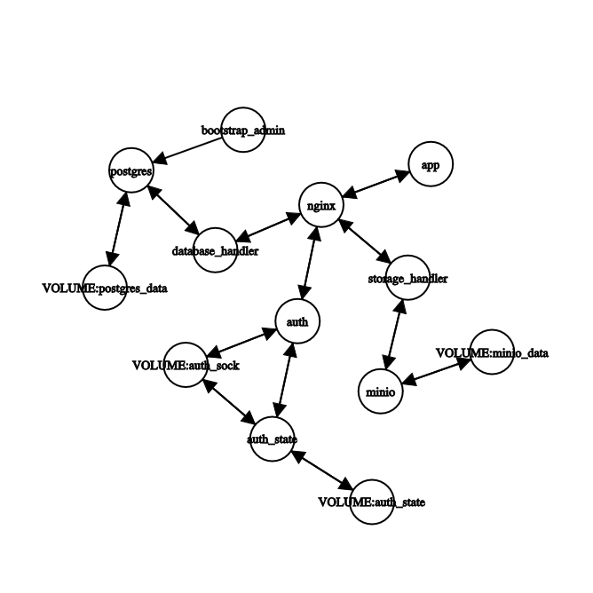

# Muserve

Muserve is a self hosted music streaming platform that allows for multiple users
to occupy one cloud, share music, and build playlists. Bring your own mp3, wav,
etc and stream it from your server to your computer and eventually phone!

## Usage

Please use MusicBrainz Picard for best results, ***ymmw***.

NOTE: Muserve should not be used to upload playlists; rather you should upload
songs and let the service sort them by their metadata. From there you can build
playlists in the application.

### Metadata (Required Read)

Muserve will digest songs based on their metadata tags. At a minimum the tags:
`Title` and `Artist` are required. Additionally the tags `Album` and
`Track Number` can be used.

***Note***: if `Album` is supplied but not `Track Number`, Muserve will append
the song to the end of any existing album if it exists, else it will create a
new one.

***Note***: if `Track Number` is supplied but not `Album`, the song will be
appended to the artist's auto created "Misc Songs" album.

***Note***: Any song uploaded without the metadata fields `Title` and `Artist`
will be rejected by the service on upload.

<!--
TODO: add section about changing files order or data once uploaded once
      implemented.
-->

### Digesting Albums 

Using the program (Picard), add the folder containing your album.

Next select the songs and click "Lookup" in the top bar of the application.

From there on the right pannel, some albums will show up, find the one that is
most correct to what you have.

Next right click on the title of that album, it will look something like
`Title of the Album (n/m; ...)`, then you *can* select "Other Versions" to try
to match your Album. Once you find one that fits, select it.

Finally right click the title and select "Save", this will overwrite the
metadata of the files and ensure that Muserve will correctly order your albums.

### Digesting Songs

Using the program (Picard), add the folder containing your songs.

Next select all the songs under "Unclustered Files" and click "Lookup" in the
top bar of the application.

Finally, you can either select all files on the right pane of the application
and click "Save" in the top bar, or you can save each individually after making
some changes to the metadata.

## Topology




config:
```
postgres
minio
nginx

auth_state
auth

bootstrap_admin

database_handler

storage_handler

app

VOLUME:postgres_data
VOLUME:minio_data
VOLUME:auth_sock
VOLUME:auth_state

nginx app
app nginx

nginx auth
auth nginx

postgres database_handler
database_handler postgres

minio storage_handler
storage_handler minio

VOLUME:postgres_data postgres
postgres VOLUME:postgres_data

VOLUME:minio_data minio
minio VOLUME:minio_data

auth_state auth
auth auth_state

auth_state VOLUME:auth_sock
VOLUME:auth_sock auth_state

auth_state VOLUME:auth_state
VOLUME:auth_state auth_state

auth VOLUME:auth_sock
VOLUME:auth_sock auth

nginx storage_handler
storage_handler nginx

bootstrap_admin postgres

nginx database_handler
database_handler nginx
```
