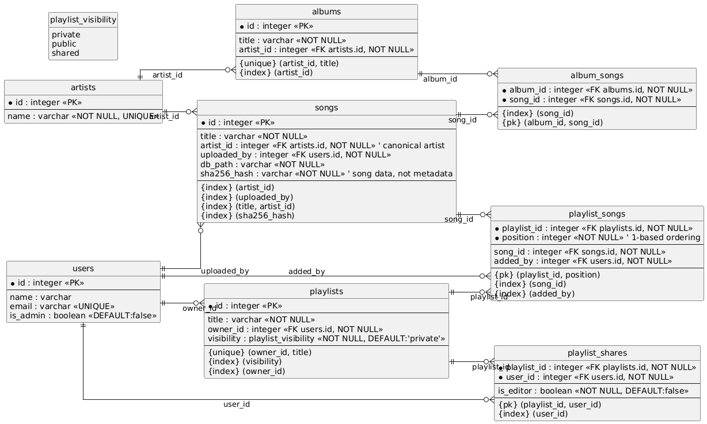

# Muserve Server

## Database Schema



## Configuration

The app will check the following locations for a config in order. If a config
doesn't yet exist, please make a copy of the example config.

```
~/.config/muserve/muserve.json
```

or

```
./muserve.json
```

Alternately, you can use `--conf [path to conf]` to specify a custom location.

## Usage

```
docker compose up --build # initial build
docker compose up -d # detach and send all to background
docker ps <service> # view process
docker compose logs -f <service> # follow process (like --tail)
docker compose logs --tail=<N> -f <service> # follow a process up to N lines
docker compose exec <service> # interactive shell of process
```
